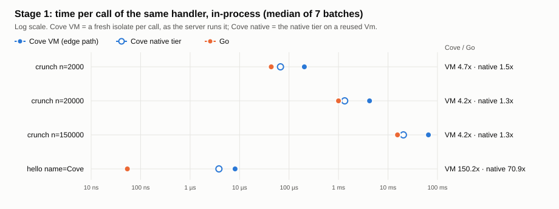
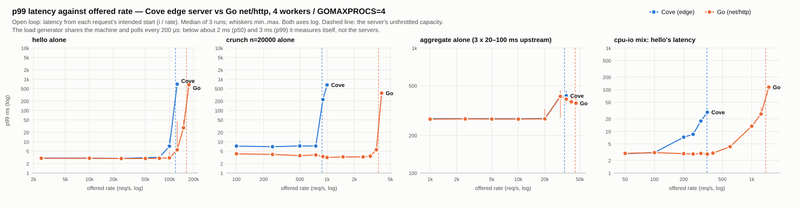
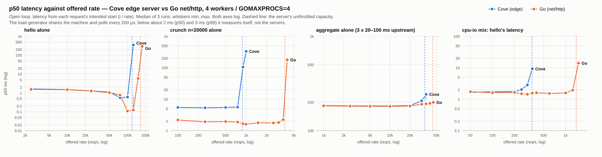
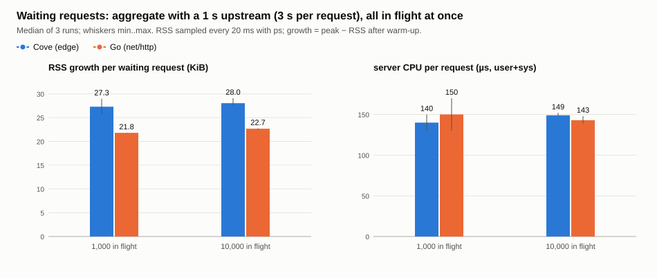
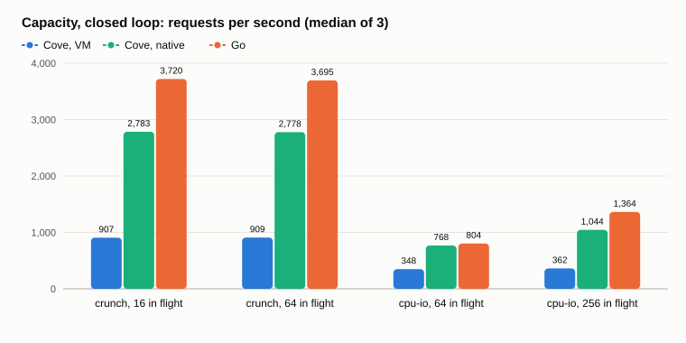
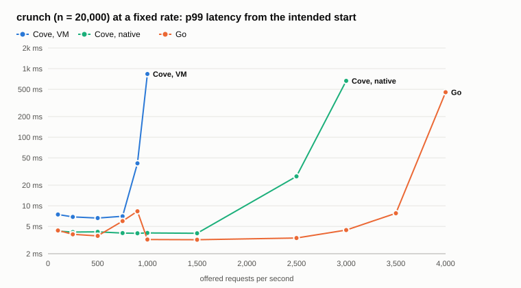
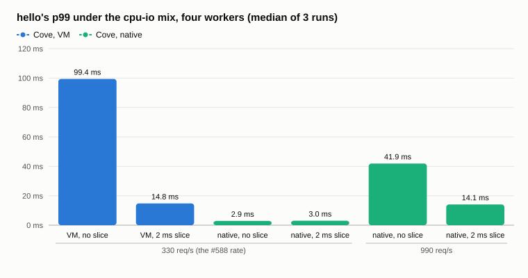

# edge against Go: what the isolates cost

[`examples/edge`](../README.md) serves each request in a fresh Cove isolate on
four worker threads, under fuel, a deadline and a host-call budget, with
capabilities checked at deploy and at the boundary. This directory asks what
that costs against **the same service written the ordinary way in Go** —
`net/http`, a goroutine per connection, `time.Timer` for the simulated
upstream, `context.WithTimeout` for a deadline, and nothing else
([`go/`](go/), std only). The Go server is the performance baseline. What
Cove adds is listed under [conditions](#conditions) as a difference, not
emulated in the Go code, so the price of it shows up in the numbers.

The comparison is split in two so that the VM's speed and the servers' HTTP
and scheduling are not mixed up:

- **Stage 1, function level**: the same handler, the same input and the
  same output, timed in-process. No sockets, no process start.
- **Stage 2, service level**: both servers on the same CPUs, at the same
  arrival rates, with the same mix and the same simulated upstream waits,
  driven by the same load generator (`cove-edge-load`).

All figures were measured on 2026-10-04 on one machine: an Intel i7-10700K
(8 cores, 16 hardware threads, x86-64) with 32 GB, macOS 26.6.2, rustc
1.98.1 `--release`, and Go 1.23.2. Other agents' builds were running on the
same machine, and the load average was **2.5 to 9** over the session. Each
row records the load average before it ran (in `results/*.jsonl`).

A second pass the same evening tested the first pass's diagnosis rather
than repeating it — a disassembly and a profile of `crunch` on the native
tier, a CPU profile of the server under `hello`, the parking lot's timer
taken apart per answer, and the idle thread's cost counted — and is
[Verifying the diagnosis](#verifying-the-diagnosis). It labels every claim
on this page *observed*, *estimated* or *predicted*
([the table](#5-the-first-passs-claims-labelled)), and where a claim did not
survive, the text below says so where it is made.

## Reproducing

```console
$ cargo build --release -p cove-edge --features native     # the servers, the load generator, cove-edge-compare
$ (cd examples/edge/compare/go && go build -o edge-go .)
$ ./target/release/cove-edge-compare --batches 7 --min-ms 300 > examples/edge/compare/results/stage1-cove.txt
$ (cd examples/edge/compare/go && ./edge-go bench -batches 7 -min-ms 300 > ../results/stage1-go.txt)
$ python3 examples/edge/compare/sweep.py capacity --reps 3
$ python3 examples/edge/compare/sweep.py capacity --reps 3 --scenario aggregate cpu-io --concurrency 10000 1024
$ python3 examples/edge/compare/sweep.py sweep --reps 3          # about 25 minutes
$ python3 examples/edge/compare/sweep.py connections --reps 3
$ python3 examples/edge/compare/sweep.py waiting --reps 3
$ python3 examples/edge/compare/charts.py [--png DIR]            # the SVGs here; PNGs via headless Chrome
$ python3 examples/edge/compare/charts.py --tables               # the tables below
```

The second pass's ([Verifying the diagnosis](#verifying-the-diagnosis)),
each of which says more at the top of its file:

```console
$ ./target/release/cove-edge-compare --batches 7 --min-ms 200 --breakdown        # hello's parts, in-process
$ COVE_NATIVE_DUMP=/tmp/dump ./target/release/cove-edge-compare --batches 1 --min-ms 1   # the tier's machine code
$ python3 examples/edge/compare/crunch-asm/disas.py /tmp/dump/7.crunch.primesUpTo.bin
$ (cd examples/edge/compare/crunch-asm && cc -O2 bins.c go.s -o bins && \
   OFFSETS=0,16,32,48 ./bins 20000 7 100 ../results/crunch-native/*.bin)
$ xcrun xctrace record --template 'Time Profiler' --attach PID --time-limit 8s --output hello.trace
$ xcrun xctrace export --input hello.trace \
    --xpath '/trace-toc/run[@number="1"]/data/table[@schema="time-profile"]' > hello.xml
$ python3 examples/edge/compare/profile.py hello.xml --requests N [--within invoke_within_parkable --depth 3]
$ (cd examples/edge/compare/timer-probe && cc -O2 probe.c -o probe && ./probe 8)
$ sh examples/edge/compare/timer_runs.sh 3 base=PATH/cove-edge fixed=PATH/cove-edge
$ python3 examples/edge/compare/timer_delay.py --summarise examples/edge/compare/results/timer.jsonl
$ python3 examples/edge/compare/idle_cost.py --reps 2
$ python3 examples/edge/compare/ab.py --rounds 5 --out results/ab-X.jsonl a=PATH b=PATH -- LOAD ARGS
```

The binaries the A/B rows name (`scratch/cove-edge-*`) were release builds
copied aside so that two variants could run in turn: `base` is fcf64a9,
`sock`, `wake` and `kqueue2` are the branches named in items 2 and 3 (`wake`
on top of `sock`), and `poll` and `kqueue` are the earlier versions of the
lot change those items describe.

`ab.py`, `idle_cost.py` and `timer_runs.sh` use ports 8797 and 8799, not
`sweep.py`'s 8787 and 8788, and every one of them now refuses a port that
something already answers on: in the second pass a `sweep.py` in another
worktree and an `ab.py` here shared 8787 and the summary file in `/tmp` for a
minute, and each measured the other's server. Those rows were thrown away;
`sweep.py` now writes its summary to a file of its own per process.

`sweep.py` appends to `results/*.jsonl`, which hold every run behind this
page. It starts each server alone for each scenario, with `--workers 4` or
`GOMAXPROCS=4`, warms every endpoint once, and stops it afterwards. The edge
server and the Go server take turns, so if the machine's load changes it
lands on both. `--features native` matters to `cove-edge-compare` and to
`cove-edge --backend native` (`sweep.py --servers cove-native`, [below](#the-native-backend-adr-0085));
without `--backend native` the server's isolates run encoded, as every row
above this section's does.

The Go module is not part of the Cargo workspace and nothing in the gate
builds it. `go/edge-go` is ignored by git.

## Conditions

| | Cove `examples/edge` | Go `compare/go` |
| --- | --- | --- |
| endpoints, bodies | `hello`, `crunch`, `counter`, `aggregate`, `impatient`, `proxy` | the same paths and the same 200 bodies (checked byte for byte with `curl`). Error bodies differ: Go's 504 is one line, not the runtime's diagnostic |
| `crunch` algorithm | `tenants/crunch/crunch.cove` | the same loops line for line, `int64` |
| simulated upstream | `upstream.get`: 20–100 ms from `Latency::pick` (splitmix over a call counter), parked | the same function, the same counter, the same services; a `time.Timer` per call in the request's goroutine |
| deadlines | `impatient` 300 ms, `proxy` 500 ms, `aggregate` 5 s, from the start of the run; the parking lot cancels a run whose deadline passes → 504 | `context.WithTimeout` from the start of the handler → 504 |
| `proxy` fetch | 4 fetcher threads, a new connection per fetch (`Connection: close`) | `http.Client` with keep-alive (`MaxIdleConnsPerHost` 1024: the default of 2 is a known trap). The same allowlist check, as a plain map lookup |
| CPU | 4 worker threads, plus accept, idle poller (`poll(2)`), parking lot (timer), slice monitor, 4 fetchers: **13 threads** idle | `GOMAXPROCS=4` (4 Ps), plus the runtime's netpoller (kqueue) and sysmon, and threads for blocking syscalls: **5 threads** idle |
| scheduling | a run queue per worker, work stealing, a 2 ms slice at VM safepoints (ADR 0084) | Go's scheduler: per-P queues, work stealing, async preemption at 10 ms |
| keep-alive | idle 5 s, 1,000 requests per connection | `IdleTimeout` 5 s, no per-connection cap |
| **isolation** | a fresh isolate (`OwnedVm`) per request, with its own heap. A tenant cannot see another's memory | none: one address space, shared heap |
| **budgets** | fuel per request (`crunch` 30 M, `hello` 2 M), a host-call limit, a wall-clock deadline, all enforced by the runtime | none. `/hello/spin` is not ported, because an ordinary Go handler has nothing that stops a loop |
| **capabilities** | checked at deploy from the call graph (`greedy` is refused), and at the boundary on every host call | none |
| **record/replay, timeline** | host calls are recordable, and `--timeline` is available (off in these runs) | none |
| **yield** | a long run gives its worker up at a safepoint when others wait | the Go runtime preempts goroutines; there is nothing to opt into |

The load generator, `cove-edge-load`, runs on the same machine with 8
threads, each polling its share of the sockets without blocking. When nothing
progresses it sleeps 200 µs. **That sleep and the shared machine set a floor
of about 1.5 ms (p50) and 3 ms (p99) under which it measures itself rather
than either server.** At low load both servers sit on the floor; the edge
server's own `/_stats` says its server-side hello latency is 0.05 ms at the
median. Under heavy load the generator stops sleeping and the floor falls,
which is why some p50s *drop* as the rate rises.

### Changes to the load generator

`--rate N` used to measure latency from when a request was actually written.
If every one of the `--concurrency` connections was busy when request *i*
was due, it was written later and its wait went unrecorded: coordinated
omission. The flags below are new, and the old behaviour stays the default
because `examples/edge/README.md`'s numbers were measured with it:

- `--from-intended` measures from request *i*'s intended start, *i* / rate
  into the run, which is what an open-loop arrival process sees. Every
  Stage 2 sweep uses it.
- The send lag is always reported under `--rate` (p50, p99 and max, and
  how many requests were sent more than 1 ms late), so a run where the
  connection cap bound shows it.
- `--summary-out FILE` writes the run as JSON. It includes the latency both
  from the intended start and from the send (`p99_sent_ms`), overall and
  per tenant.
- A kept-alive connection idle for 2 s is dropped and reopened when next
  needed. Without this, a connection idle past a server's 5 s timeout
  failed its next request with "the response has no head" — the
  generator's failure, counted against the server.

The sweeps size the connection pool per scenario: about twice the arrivals
of one typical latency, and at least 64 (`POOL_SECONDS` in `sweep.py`).
They do not use the largest pool that could ever be needed, because idle
kept-alive connections are not free on the edge server (see
[connections](#connections)). Above a server's capacity the pool binds, and
the send lag shows it. The latency still counts from the intended start.

## Stage 1: the same function

`cove-edge-compare` ([`host/src/bin/compare.rs`](../host/src/bin/compare.rs))
times each case three ways:

- **edge**: what the server pays per request, less the socket. It builds the
  `edge.Request` value, takes a fresh isolate (`Deployed::isolate`), runs it
  under the tenant's budget (`invoke_within_parkable`), and reads the body
  back out.
- **vm**: one reused `Vm` over the same lowered program.
- **native**: the same, on `compile_native`'s machine code.

`edge-go bench` ([`go/bench.go`](go/bench.go)) times **go**, the handler with
its query map built once, and **go+map**, which builds the map per call too.
Every mode's answer is compared with the first one's before timing, and all
of them print the same bytes: `"2262 primes up to 20000, the largest
19997\n"`, `"Hello, Cove! (GET /)\n"` and so on (in
[`results/stage1-*.txt`](results/)). Each figure is the median of 7 batches
of at least 300 ms. The spread between batches was under 2% except where
noted.

| case | Cove edge path | Cove VM, reused | Cove native | Go | Go+map | **edge / Go** | **native / Go** |
| --- | ---: | ---: | ---: | ---: | ---: | ---: | ---: |
| `crunch n=2000` | 203.60 µs | 198.10 µs | 67.09 µs | 43.69 µs | 44.26 µs | **4.7×** | **1.5×** |
| `crunch n=20000` | 4.23 ms | 4.40 ms | 1.33 ms | 997.40 µs | 998.57 µs | **4.2×** | **1.3×** |
| `crunch n=150000` | 65.68 ms | 66.71 ms | 20.49 ms | 15.55 ms | 15.53 ms | **4.2×** | **1.3×** |
| `hello name=Cove` | 8.11 µs | 3.88 µs | 3.83 µs | 54 ns | 217 ns | **150.2×** | **70.9×** |

The native tier compiled every function each case reaches (8 of 8 for
`crunch`, 5 of 5 for `hello`).



**`crunch` is the VM.** A fresh isolate adds nothing measurable to a call
of 0.2 ms or more: edge and the reused VM are within 4%, in either order.
What is left is 4.2× Go on the encoded VM and **1.3× on the native tier**
from `n` = 20,000 up (4.7× and 1.5× at 2,000, where the 8 µs per-call cost
is 4% of the call). Past that the ratio does not depend on `n`, so it is
per iteration, not per call.

**`hello` is fixed cost.** It takes 8.1 µs per request against Go's 54 ns
(217 ns building the map). The native tier does not help (3.83 against
3.88 µs), because the time is not spent in the handler. A handler that
answers a constant `edge.Response` and never reads the request (a
throwaway tenant directory outside the repository; its timings are in `results/stage1-cove-noop.txt`) takes **6.65 µs** on the
edge path and **2.98 µs** on a reused VM. So, per request — *estimated*, by
differences between separate measurements; item 2 of
[Verifying the diagnosis](#2-hello-the-per-request-cost-measured-instead-of-by-remainder)
times each part directly, and the isolate, request value and budget come to
2.9 µs rather than 3.7–4.2:

| part | µs | how it was found |
| --- | ---: | --- |
| a fresh isolate, the `edge.Request` value built, the budget | 3.7–4.2 | edge path − reused VM, for the constant handler and for `hello` |
| one `invoke` that does nothing: the `Request` into the VM, a `Response` out | 3.0 | the constant handler on a reused VM |
| `hello`'s own work (a map lookup, `unwrapOr`, a three-part interpolation) | 0.9 | `hello` − the constant handler, reused VM |

`hello`'s own work is about 17× Go's 54 ns, a plausible VM ratio for string
code. The other 7 µs is the price of entering and leaving an isolate, and
the next section shows it is not the larger part of the server's
per-request cost.

## Stage 2: the same service

### Capacity

Closed loop, unthrottled, keep-alive, at the stated number in flight. Each
figure is the median of 3 runs (range in parentheses). CPU is the server
process's user+sys over the run (`ps -o time`), divided by the requests
answered.

| scenario | in flight | Cove req/s | Go req/s | Go / Cove | Cove CPU µs/req | Go CPU µs/req | Cove p50 / p99 ms | Go p50 / p99 ms |
| --- | ---: | ---: | ---: | ---: | ---: | ---: | ---: | ---: |
| hello | 64 | 84,235 (81,574–86,650) | 122,725 (122,716–124,420) | 1.46 | 41 | 23 | 0.6 / 2.0 | 0.4 / 1.9 |
| hello | 256 | 119,242 (117,127–120,390) | 163,543 (158,353–163,608) | 1.37 | 41 | 23 | 2.1 / 4.1 | 1.4 / 4.0 |
| crunch | 16 | 881 (867–883) | 3,696 (3,696–3,713) | 4.20 | 4560 | 1078 | 18.1 / 29.6 | 4.0 / 10.2 |
| crunch | 64 | 878 (867–879) | 3,691 (3,635–3,697) | 4.20 | 4570 | 1078 | 74.0 / 121.6 | 15.0 / 45.7 |
| aggregate | 2,000 | 10,307 (10,051–10,390) | 10,482 (10,474–10,482) | 1.02 | 187 | 109 | 181.3 / 269.9 | 181.0 / 269.8 |
| aggregate | 5,000 | 24,519 (24,433–24,707) | 24,438 (24,395–24,478) | 1.00 | 174 | 92 | 182.4 / 271.1 | 182.8 / 272.0 |
| aggregate | 10,000 | 33,500 (32,785–33,778) | 44,245 (43,983–44,246) | 1.32 | 152 | 71 | 269.7 / 363.6 | 195.2 / 335.0 |
| cpu-io | 64 | 335 (330–340) | 807 (802–807) | 2.41 | 11585 | 2610 | 192.3 / 540.3 | 10.0 / 301.7 |
| cpu-io | 256 | 347 (345–351) | 1,345 (1,341–1,347) | 3.87 | 11550 | 2600 | 577.9 / 2727.5 | 112.2 / 479.8 |
| cpu-io | 1,024 | 338 (336–344) | 1,393 (1,390–1,404) | 4.12 | 11842 | 2724 | 1808.8 / 10891.2 | 688.5 / 1342.7 |

- **`crunch`: 4.20× at the server, 4.24× in Stage 1.** For CPU-heavy work
  the server adds nothing to the VM's gap. 4.56 ms of CPU per request on
  the edge server against 4.23 ms per call in Stage 1, and 1.08 ms against
  1.00 ms for Go.
- **`hello`: 1.37–1.46×**, at **41 µs of server CPU per request against
  Go's 23 µs**. Stage 1 accounts for 8 µs of the 41. The edge server's
  `--timeline` on a hello run at 10,000 req/s gives 14.8 µs of worker time
  per request (run start to run end, which includes building the request
  value and the response) and 0.05 ms from queued to written at the median.
  So **about 26–33 µs per request is the edge host's own HTTP, run queue,
  idle-thread hand-off and write**, which is more than Go's whole
  per-request cost of 23 µs. The isolate is a fifth of the fixed cost, not
  most of it. (*Estimated*, as a remainder of three separate measurements.
  The second pass's CPU profile *observed* it: 73% of the server's sampled
  CPU is the host's, 29 µs scaled to `ps`, and the isolate's part is about a
  quarter — item 2.)
- **`aggregate`: throughput within 2% while the load is
  concurrency-bound** (2,000 and 5,000 in flight: 1.00–1.02×) — at 1.7–1.9×
  Go's CPU per request, which a concurrency-bound run does not show as
  throughput. At 10,000 in flight it is **1.32×**:
  33,500 against 44,245 req/s, with the edge server's p50 at 270 ms against
  195 ms. A request costs 152 µs of CPU against 71 µs: three parks, three
  resumes and three timer entries against three goroutine sleeps.
- **`cpu-io`: 2.4–4.1×**, rising with concurrency, because Go's closed loop
  at 64 in flight is bound by the mix's waits and not by its CPU. It is
  `crunch`'s ratio once enough is in flight.

### Latency against offered rate

Open loop, `--from-intended`, 4 s of arrivals per point (at least 1,000
requests), 3 runs per point. Each server was swept up to 1.15× its own
capacity and no further. Past saturation an open-loop run only measures how
long it lasted, so "–" means *not run*. The x axis is the same absolute
grid for both servers, so the point where a curve turns up is where that
server gets tight.





Latencies in ms, median (range) of 3 runs. "from send" is the same requests measured from when they were written, which understates once the pool binds. CPU is server CPU per answered request, in µs.

#### hello alone

| offered req/s | Cove p50 | Cove p99 | Go p50 | Go p99 | p99 Cove / Go | Cove p99 from send | Go p99 from send | Cove CPU µs/req | Go CPU µs/req |
| ---: | ---: | ---: | ---: | ---: | ---: | ---: | ---: | ---: | ---: |
| 2,500 | 1.6 (1.6–1.6) | 3.0 (3.0–3.0) | 1.5 (1.5–1.5) | 3.0 (3.0–3.0) | 1.0x | 1.9 (1.9–1.9) | 1.9 (1.9–1.9) | 114 (113–114) | 80 (80–82) |
| 10,000 | 1.5 (1.5–1.5) | 3.0 (3.0–3.0) | 1.5 (1.4–1.5) | 3.0 (3.0–3.0) | 1.0x | 1.9 (1.9–1.9) | 1.9 (1.9–1.9) | 65 (64–65) | 43 (42–43) |
| 25,000 | 1.3 (1.2–1.3) | 2.9 (2.9–2.9) | 1.3 (1.2–1.3) | 2.9 (2.9–2.9) | 1.0x | 1.9 (1.9–1.9) | 1.9 (1.9–1.9) | 53 (52–54) | 32 (31–32) |
| 50,000 | 1.1 (1.1–1.1) | 3.1 (3.0–3.1) | 1.0 (1.0–1.0) | 2.9 (2.9–3.0) | 1.1x | 2.2 (2.2–2.2) | 2.0 (2.0–2.0) | 48 (48–49) | 28 (28–28) |
| 75,000 | 0.6 (0.5–0.6) | 3.2 (3.1–3.2) | 0.8 (0.7–0.8) | 3.0 (2.9–3.1) | 1.1x | 2.4 (2.4–2.5) | 2.3 (2.2–2.4) | 47 (46–47) | 27 (26–27) |
| 100,000 | 0.6 (0.5–0.6) | 7.2 (6.4–11.8) | 0.1 (0.1–0.1) | 3.1 (3.0–4.7) | 2.4x | 5.3 (5.0–5.6) | 2.6 (2.5–3.0) | 45 (44–45) | 28 (28–28) |
| 125,000 | 343.8 (312.5–349.2) | 697.5 (695.3–714.7) | 0.1 (0.1–0.7) | 5.5 (5.2–45.4) | 126.5x | 7.2 (7.2–7.4) | 4.2 (4.0–6.9) | 46 (46–47) | 27 (27–29) |
| 150,000 | – | – | 5.8 (4.3–9.9) | 28.1 (26.9–51.0) | – | – | 7.1 (6.8–7.3) | – | 26 (26–26) |
| 175,000 | – | – | 289.9 (282.8–349.4) | 668.8 (585.8–722.2) | – | – | 8.0 (7.9–8.3) | – | 26 (26–26) |

#### crunch n=20000 alone

| offered req/s | Cove p50 | Cove p99 | Go p50 | Go p99 | p99 Cove / Go | Cove p99 from send | Go p99 from send | Cove CPU µs/req | Go CPU µs/req |
| ---: | ---: | ---: | ---: | ---: | ---: | ---: | ---: | ---: | ---: |
| 100 | 5.5 (5.4–5.5) | 7.3 (7.2–7.8) | 2.2 (2.1–2.2) | 4.1 (3.9–4.1) | 1.8x | 6.5 (6.3–6.7) | 3.0 (3.0–3.1) | 4560 (4560–4570) | 1290 (1270–1300) |
| 250 | 5.3 (5.3–5.3) | 7.0 (6.9–7.0) | 1.9 (1.9–1.9) | 3.9 (3.9–4.0) | 1.8x | 6.2 (6.1–6.3) | 3.0 (2.9–3.0) | 4410 (4400–4430) | 1210 (1200–1210) |
| 500 | 5.4 (5.3–5.4) | 7.3 (6.9–11.0) | 1.9 (1.9–1.9) | 3.6 (3.6–3.6) | 2.0x | 7.1 (6.2–10.7) | 2.8 (2.8–2.9) | 4540 (4430–4650) | 1170 (1165–1170) |
| 750 | 5.6 (5.5–5.6) | 7.3 (7.2–7.5) | 1.9 (1.9–1.9) | 3.8 (3.8–3.8) | 1.9x | 6.6 (6.4–6.7) | 2.8 (2.8–2.8) | 4643 (4593–4650) | 1137 (1137–1140) |
| 900 | 104.6 (95.0–119.5) | 224.1 (212.0–235.6) | 1.6 (1.5–1.7) | 3.4 (3.2–3.4) | 66.7x | 124.4 (118.2–124.5) | 2.8 (2.7–2.8) | 4678 (4661–4683) | 1125 (1122–1125) |
| 1,000 | 330.0 (313.0–346.6) | 657.1 (642.6–678.8) | 1.6 (1.6–1.6) | 3.1 (3.1–3.2) | 209.2x | 122.9 (122.6–127.1) | 2.7 (2.7–2.8) | 4653 (4642–4678) | 1108 (1108–1112) |
| 1,500 | – | – | 1.8 (1.8–1.8) | 3.3 (3.3–3.4) | – | – | 2.7 (2.7–2.8) | – | 1102 (1088–1107) |
| 2,500 | – | – | 1.8 (1.7–1.8) | 3.3 (3.2–3.3) | – | – | 2.8 (2.7–2.8) | – | 1090 (1086–1093) |
| 3,000 | – | – | 1.8 (1.8–1.8) | 3.5 (3.4–3.7) | – | – | 2.9 (2.9–3.3) | – | 1093 (1090–1096) |
| 3,500 | – | – | 2.2 (2.2–2.2) | 5.6 (4.6–6.0) | – | – | 5.1 (4.2–5.6) | – | 1095 (1092–1096) |
| 4,000 | – | – | 177.5 (175.6–186.1) | 359.6 (357.8–374.4) | – | – | 89.4 (87.9–91.6) | – | 1085 (1084–1087) |

#### aggregate alone (3 x 20–100 ms upstream)

| offered req/s | Cove p50 | Cove p99 | Go p50 | Go p99 | p99 Cove / Go | Cove p99 from send | Go p99 from send | Cove CPU µs/req | Go CPU µs/req |
| ---: | ---: | ---: | ---: | ---: | ---: | ---: | ---: | ---: | ---: |
| 1,000 | 184.1 (183.8–184.1) | 272.2 (271.3–274.3) | 182.9 (182.9–183.2) | 269.5 (268.5–269.8) | 1.0x | 271.5 (270.4–274.0) | 269.2 (268.3–269.3) | 452 (452–455) | 245 (242–250) |
| 2,500 | 182.6 (182.4–182.7) | 272.0 (271.6–273.2) | 181.3 (181.1–182.1) | 270.6 (269.7–270.7) | 1.0x | 271.6 (271.4–272.8) | 270.4 (269.5–270.4) | 479 (475–480) | 181 (180–184) |
| 5,000 | 182.5 (182.4–182.5) | 272.1 (270.4–272.2) | 181.0 (180.9–181.1) | 269.9 (269.1–270.5) | 1.0x | 272.0 (270.4–272.0) | 269.7 (268.7–270.5) | 340 (337–342) | 138 (138–143) |
| 10,000 | 182.4 (182.0–182.5) | 271.3 (271.1–271.6) | 180.7 (180.6–180.8) | 269.6 (269.4–269.9) | 1.0x | 271.3 (271.1–271.6) | 269.6 (269.4–269.8) | 250 (249–251) | 119 (118–120) |
| 20,000 | 184.0 (183.9–184.1) | 273.0 (272.9–273.0) | 182.0 (182.0–186.9) | 270.8 (270.7–325.2) | 1.0x | 273.0 (272.9–273.0) | 270.8 (270.7–323.6) | 190 (190–190) | 103 (103–105) |
| 30,000 | 206.8 (206.5–207.3) | 410.4 (396.7–413.8) | 190.3 (184.7–191.8) | 409.9 (276.7–457.4) | 1.0x | 410.1 (396.6–413.8) | 409.8 (276.6–457.4) | 161 (160–161) | 89 (88–89) |
| 35,000 | 242.1 (212.2–254.3) | 415.1 (394.5–454.8) | 192.3 (192.3–193.8) | 389.7 (358.7–399.2) | 1.1x | 414.8 (393.9–444.0) | 389.5 (358.5–399.2) | 151 (151–152) | 82 (82–83) |
| 40,000 | – | – | 194.5 (194.2–194.6) | 371.3 (369.4–409.6) | – | – | 371.1 (367.2–409.4) | – | 77 (77–77) |
| 45,000 | – | – | 198.8 (198.2–199.8) | 361.5 (356.8–395.9) | – | – | 354.9 (352.4–378.4) | – | 72 (72–72) |

#### cpu-io mix: hello's latency

| offered req/s | Cove p50 | Cove p99 | Go p50 | Go p99 | p99 Cove / Go | Cove p99 from send | Go p99 from send | Cove CPU µs/req | Go CPU µs/req |
| ---: | ---: | ---: | ---: | ---: | ---: | ---: | ---: | ---: | ---: |
| 50 | 1.6 (1.5–1.7) | 2.9 (2.9–2.9) | 1.7 (1.6–1.8) | 3.0 (2.9–3.0) | 1.0x | 1.9 (1.9–2.0) | 1.9 (1.9–1.9) | 11270 (11250–11370) | 2900 (2900–2910) |
| 100 | 1.7 (1.5–1.8) | 3.1 (3.0–3.5) | 1.6 (1.6–1.7) | 3.1 (2.9–3.2) | 1.0x | 1.9 (1.9–3.0) | 1.9 (1.9–1.9) | 11110 (11100–11150) | 2840 (2830–2850) |
| 200 | 1.7 (1.7–1.8) | 7.3 (6.5–8.6) | 1.6 (1.6–1.6) | 2.9 (2.8–3.0) | 2.5x | 6.6 (6.2–8.4) | 1.9 (1.9–2.0) | 11290 (11280–11310) | 2770 (2770–2790) |
| 250 | 2.0 (1.9–2.0) | 8.5 (8.4–10.3) | 1.5 (1.4–1.6) | 2.9 (2.8–2.9) | 3.0x | 8.3 (8.0–10.1) | 1.9 (1.9–1.9) | 11490 (11420–11640) | 2750 (2750–2750) |
| 300 | 2.8 (2.7–2.9) | 17.7 (16.8–18.4) | 1.4 (1.4–1.6) | 3.0 (2.9–3.0) | 6.0x | 16.9 (16.8–18.3) | 1.9 (1.9–1.9) | 11608 (11608–11633) | 2725 (2725–2742) |
| 350 | 9.2 (9.0–10.8) | 28.7 (28.6–35.3) | 1.6 (1.5–1.6) | 2.8 (2.7–2.9) | 10.1x | 28.2 (27.9–34.9) | 1.9 (1.9–1.9) | 11993 (11986–12014) | 2757 (2750–2757) |
| 400 | – | – | 1.6 (1.6–1.6) | 3.0 (3.0–3.0) | – | – | 2.0 (1.9–2.1) | – | 2725 (2725–2725) |
| 600 | – | – | 1.5 (1.5–1.5) | 4.3 (3.7–4.5) | – | – | 4.2 (3.4–4.2) | – | 2638 (2633–2650) |
| 1,000 | – | – | 1.6 (1.5–1.6) | 13.3 (12.9–14.5) | – | – | 12.8 (12.4–14.3) | – | 2587 (2580–2590) |
| 1,250 | – | – | 1.9 (1.9–1.9) | 26.1 (25.5–37.6) | – | – | 25.7 (24.9–37.3) | – | 2624 (2608–2636) |
| 1,500 | – | – | 13.9 (13.0–15.0) | 114.8 (112.0–123.9) | – | – | 114.8 (111.8–123.6) | – | 2633 (2632–2635) |

#### cpu-io mix, every tenant (p50 / p99 ms, median of 3)

| offered | server | aggregate | crunch | hello | impatient | proxy |
| ---: | --- | ---: | ---: | ---: | ---: | ---: |
| 50 | cove | 261.7 / 422.5 | 17.2 / 71.6 | 1.6 / 2.9 | 301.1 / 361.7 | 2.0 / 3.3 |
| 50 | go | 182.1 / 263.5 | 5.9 / 18.5 | 1.7 / 3.0 | 300.6 / 303.0 | 1.7 / 3.0 |
| 100 | cove | 221.7 / 335.0 | 16.8 / 71.2 | 1.7 / 3.1 | 301.1 / 341.5 | 1.8 / 3.2 |
| 100 | go | 187.6 / 272.3 | 5.7 / 18.1 | 1.6 / 3.1 | 300.7 / 302.9 | 1.6 / 2.9 |
| 200 | cove | 202.7 / 315.0 | 20.4 / 114.1 | 1.7 / 7.3 | 300.6 / 323.1 | 1.8 / 16.7 |
| 200 | go | 181.7 / 268.3 | 5.5 / 17.9 | 1.6 / 2.9 | 300.7 / 302.9 | 1.6 / 2.9 |
| 250 | cove | 202.0 / 347.1 | 30.7 / 158.3 | 2.0 / 8.5 | 300.7 / 316.9 | 2.1 / 16.2 |
| 250 | go | 180.5 / 264.9 | 5.4 / 17.8 | 1.5 / 2.9 | 300.6 / 302.8 | 1.6 / 2.9 |
| 300 | cove | 198.5 / 307.1 | 41.2 / 242.8 | 2.8 / 17.7 | 169.5 / 319.9 | 4.1 / 35.1 |
| 300 | go | 183.6 / 271.3 | 5.5 / 18.1 | 1.4 / 3.0 | 164.0 / 302.4 | 1.5 / 2.9 |
| 350 | cove | 226.4 / 332.0 | 87.6 / 410.3 | 9.2 / 28.7 | 201.7 / 338.6 | 23.9 / 71.5 |
| 350 | go | 183.1 / 268.6 | 5.9 / 18.0 | 1.6 / 2.8 | 171.1 / 302.5 | 1.5 / 3.0 |
| 400 | go | 181.7 / 268.8 | 6.2 / 17.7 | 1.6 / 3.0 | 178.9 / 302.9 | 1.5 / 2.8 |
| 600 | go | 185.2 / 270.7 | 5.9 / 18.1 | 1.5 / 4.3 | 187.9 / 306.0 | 1.5 / 5.7 |
| 1,000 | go | 185.5 / 276.0 | 9.1 / 23.4 | 1.6 / 13.3 | 191.9 / 312.8 | 1.6 / 15.2 |
| 1,250 | go | 192.0 / 287.1 | 9.8 / 36.9 | 1.9 / 26.1 | 195.9 / 324.3 | 2.2 / 41.9 |
| 1,500 | go | 234.8 / 402.7 | 19.6 / 125.7 | 13.9 / 114.8 | 277.1 / 422.6 | 32.0 / 277.1 |

What the curves say:

- **`hello`: indistinguishable up to 75,000 req/s.** Both servers are on
  the generator's floor. Cove's p99 lifts to 7 ms at 100,000 (Go 3.1) and
  Cove saturates at 125,000, where it answered about 105,000 req/s. Go stays
  at 5.5 ms through 125,000 and saturates at 175,000. So Cove gets tight at
  **about 80% of Go's rate**, and the 1.4× capacity ratio is the whole
  story. A request at either server costs far less than the client can
  resolve.
- **`crunch`: flat, then a wall, as a CPU-bound queue should be.** Cove's
  p99 is 7–7.3 ms up to 750 req/s (85% of its capacity) and 224 ms at 900.
  Go's is 3.4–4.1 ms up to 3,000 and 5.6 ms at 3,500. Below saturation the
  difference is the run itself: 4.2 against 1.0 ms. The knee is at the same
  fraction of each server's capacity, so the slice and the run queues add no
  tail of their own. (*Estimated*: inferred from where the curves turn, not
  measured by taking the slice or the queues away.)
- **`aggregate`: indistinguishable at this tool's resolution up to 20,000
  req/s** (p99 271 against 270 ms, all of it upstream: a 1 ms difference
  under a 3 ms p99 floor, which is not the same as equal — item 3 of the
  second pass found the edge server's simulated answers 7 ms late at the
  median at low rates, which a single `aggregate` row cannot resolve). At
  30,000 to 35,000 Cove's p50 rises to 207–242 ms
  against Go's 190–192, and Cove saturates past 35,000 while Go answers
  45,000 at p50 199 ms.
- **The mix: Cove's `hello` gets tight at 200 req/s, Go's at about 600.**
  Cove's p99 for `hello` is 7.3 ms at 200 req/s, 18 ms at 300 and 29 ms at
  350, its saturation. Go's stays at 3 ms through 400 req/s and reaches
  13 ms at 1,000 and 115 ms at 1,500. Measured *against each server's own
  capacity* the two are alike: Cove at 72% (250 req/s) has `hello` p99
  8.5 ms, and Go at 72% (1,000 req/s) has 13.3 ms. The edge scheduler
  shares four workers between long and short runs about as well as Go's,
  and the absolute gap is `crunch` taking 4.2× longer. (*Estimated*, by
  that comparison at a fraction of capacity; the scheduler was not measured
  alone.)
- **At low rates in the mix, Cove's `aggregate` is 80 ms slower** (p50 262
  against 182 ms at 50 req/s, and 222 against 188 at 100). The gap closes as
  the load rises (199 against 184 at 300). This is the macOS idle-timer
  overshoot `examples/edge/README.md` describes under "numbers": the
  parking lot waits in `recv_timeout`, and when the process is mostly idle
  that wakes late. Go's timers wake on time at the same load.
  `impatient`'s p99 is 362 against 303 ms for the same reason. (The cause
  is *observed* in the second pass, item 3, and "idle" was wrong: the
  condition variable's timed wait is late at any load on this machine, and
  a busy lot only hides it because each new park wakes it early.)

### Connections

The same 10,000 `hello` requests a second, spread over more and more
kept-alive connections (4 s, 3 runs, median). This experiment was added
because the first sweep, run with a pool of a second's worth of arrivals,
showed the edge server's `hello` p50 *worse* at 10,000 req/s (8.6 ms) than at
saturation, and 453 µs of CPU per request at 2,500 req/s.

| connections | Cove p50 / p99 ms | Go p50 / p99 ms | Cove CPU µs/req | Go CPU µs/req |
| ---: | ---: | ---: | ---: | ---: |
| 64 | 1.39 / 2.93 | 1.35 / 2.92 | 66 | 46 |
| 256 | 1.23 / 2.92 | 1.32 / 2.92 | 94 | 47 |
| 1,000 | 1.33 / 4.17 | 1.31 / 2.94 | 135 | 51 |
| 4,000 | 3.82 / 11.82 | 0.74 / 2.99 | 142 | 61 |
| 10,000 | 8.16 / 22.05 | 0.06 / 2.64 | 143 | 62 |

**Up to 1,000 connections the two servers' latencies are indistinguishable
at this tool's resolution** (p50 1.33 against 1.31 ms, under the 1.5 ms
floor) — but they are not the same: **the edge server's CPU per request
already rises with the connections, 66 → 94 → 135 µs, while Go's stays at
46–51**, 2.6× Go's at 1,000. From 4,000 on the edge server falls behind in
latency too: 136× Go's p50 at 10,000 connections and 2.3× its CPU per
request. The cause is the one
[`host/src/idle.rs`](../host/src/idle.rs) names: the idle thread `poll(2)`s
every idle connection on every wake-up, so each request that goes idle costs
O(idle connections). Go's netpoller is kqueue, which is O(ready). (That was
*estimated* from the shape of the curve; the second pass *observed* it, item
4: the idle thread is saturated from about 1,000 connections.) Opening a
connection also costs something here: the generator reopened more of them
against the edge server (12,200 against 6,700 at 10,000) because its
connections were answered later and passed the generator's 2 s idle drop
more often.

### Waiting requests

`aggregate` with every upstream call at 1 s (so 3 s per request), N
requests at once, a connection each. RSS is sampled with `ps` every 20 ms;
growth is the peak minus the RSS after warm-up, divided by N. CPU is the
whole run's, divided by N.



| in flight | server | answered 200 | RSS after warm-up MiB | peak RSS MiB | KiB per waiting request | CPU µs per request | p50 ms |
| ---: | --- | ---: | ---: | ---: | ---: | ---: | ---: |
| 1,000 | cove | 1000 | 29.1 | 56.3 | 27.3 (25.8–29.0) | 140 (130–150) | 3294 |
| 1,000 | go | 1000 | 5.9 | 27.2 | 21.8 (21.7–21.8) | 150 (130–170) | 3001 |
| 10,000 | cove | 10000 | 29.7 | 303.3 | 28.0 (27.6–29.1) | 149 (148–152) | 3456 |
| 10,000 | go | 10000 | 5.8 | 227.2 | 22.7 (22.4–22.7) | 143 (139–148) | 3002 |

- **Memory: 27–28 KiB per waiting request on the edge server against
  22–23 KiB for Go**, 1.25×, at both 1,000 and 10,000. A parked run is
  18–22 KB by ADR 0080's and 0081's measurements, and the socket and
  buffers are the rest. A goroutine's stack and `net/http`'s per-connection
  buffers come to about the same on Go's side. Ten thousand waiting requests
  cost 303 MiB against 227. **The same class**: neither grows with anything
  but N.
- **CPU per request: indistinguishable at `ps`'s resolution**, 140–150 µs
  on both, connection setup included (10 ms ticks over a few seconds, and
  the ranges overlap).
- **p50 3.29–3.46 s against 3.00 s.** The parking lot's timer overshoot
  again, about 100 ms on each of the three waits. (*Observed* in the second
  pass: with the lot waiting in `kevent` instead, the same run's p50 is
  3.00 s — item 3.)
- At rest the edge server holds 29–30 MiB RSS against Go's 6 MiB, mostly the
  seven deployed tenants' prepared programs and the standard library's
  checked state. Idle CPU over 10 s was 0.08 s against 0.00 s.

## Verifying the diagnosis

The first pass ended with a diagnosis (below) built partly from
differences between separate measurements and partly from hypotheses. A
second pass, the same evening on the same machine, tested its four parts
rather than re-running the matrix: why the native tier is 1.33× Go on
`crunch`; where `hello`'s fixed cost goes, profiled instead of found by
remainder; where a parked answer's delay goes; and what the idle thread
costs as connections grow. Where a cheap fix appeared it was made on a
branch of its own and measured against the binary before it, in interleaved
rounds; the branches are named with each result.

The machine was busier than in the first pass — load average 3.5 to 10,
with another agent's builds and benchmarks beside these — so absolute
figures are a little worse than the first pass's and the comparisons are
read as ratios between interleaved rounds. Every row records its load
average.

### 1. `crunch` on the native tier: 1.33× Go, and where it goes

**Method.** `COVE_NATIVE_DUMP=DIR` (new, in `cove-native`'s `Jit::compile`)
writes each compiled function's machine code and IR. `crunch`'s hot loop is
`primesUpTo` with `isOddPrime` inlined into it — there is no call per
candidate — in 1,155 bytes ([`results/crunch-native/base.s`](results/crunch-native/base.s),
its IR in `primesUpTo.ir`). [`crunch-asm/bins`](crunch-asm/bins.c) maps dumped
bytes executable and enters them the way the runtime does, over a context
holding only what the loop reads, against [`crunch-asm/go.s`](crunch-asm/go.s),
Go 1.23.2's own loop from `go tool objdump`
([`results/crunch-native/go-crunch.objdump.txt`](results/crunch-native/go-crunch.objdump.txt))
with its registers renamed. Each runs at four code offsets (0, 16, 32 and 48
bytes past a page), interleaved, and every answer is checked (2,262 primes
up to 20,000). A figure is the mean over offsets of each offset's median of 7
rounds; *range* is the spread over offsets.

Per iteration of the inner loop, Go executes 15 instructions with every
value in a register and one `idivq`. Cove executes the same `idivq` and 47
more: each IR slot is a load or a store through `r14`, the frame pointer is
re-derived from the context at each block (three an iteration), each block
adds its length to the work counter, the backedge compares that counter
with `poll_at`, the multiply and the add are overflow-checked, the
remainder tests for zero and for `MIN / -1`, each comparison stores a 0/1
word before testing it, and each constant is a `movabs`. An `Int` is a raw
word in its slot, not boxed or tagged.

To price one cost at a time, a scratch build of the template compiler took
switches that each remove one thing from what it emits: the backedge poll,
the work charge, the frame re-derivation, the overflow checks, the inline
raise blocks (moved to the end), the `disp32` and `movabs` encodings (made
`disp8`, `imm32` and folded immediates), the 0/1 word a fused compare
stores. The scratch build is not committed — removing a check or the poll
changes what a program means, so these are measurements and not
candidates — but the bytes it emitted are, in
[`results/crunch-native/`](results/crunch-native/), so the table re-runs
without it. **Observed** (load average 10, `crunch` `primesUpTo(20000)`
alone; [`results/crunch-native.txt`](results/crunch-native.txt). A run at load
4 agreed within 2 points):

| code | ms per call | range over offsets | vs Cove |
| --- | ---: | ---: | ---: |
| Cove native, as emitted | 1.329 | 1.318–1.338 | — |
| less the backedge poll | 1.296 | 1.288–1.302 | −2.5% |
| less the work charge | 1.308 | 1.291–1.334 | −1.6% |
| less the overflow checks (`Add`, `Mul`, `MIN / -1`) | 1.268 | 1.256–1.276 | −4.6% |
| raise blocks out of line | 1.302 | 1.299–1.308 | −2.1% |
| short encodings (`disp8`, `imm32`, folded immediates) | 1.311 | 1.289–1.330 | −1.3% |
| no frame re-derivation per block | 1.382 | 1.334–1.431 | **+4.0%** |
| no 0/1 word for a fused compare | 1.226 | 1.212–1.242 | −7.7% |
| **all of the above at once** | 1.082 | 1.074–1.093 | −18.6% |
| Go's loop (`go.s`) | 0.996 | | −25.0% |
| Go's loop with `idivl` for `idivq` | 0.356 | | −73.2% |
| Cove, with the 32-bit division below | **0.698** | 0.694–0.703 | **−47.5%** |

What it says:

- **Both loops are division-bound.** Go's runs 2.8× faster with its 64-bit
  `idivq` made a 32-bit `idivl`: at least 0.64 of its 1.00 ms is that one
  instruction. Cove's 0.33 ms more is everything around the same `idivq`.
- **No single cost is the gap.** In cumulative order — poll, charge,
  overflow checks, encodings and layout, frame re-derivation, the 0/1 word —
  the steps are 2.7, 1.6, 2.9, 2.2, 4.1 and 5.1 points of Cove's time. What
  is left, 1.082 against 0.996 ms (6.5% of Cove's time), is the frame
  itself: every value a memory operand where Go keeps all four in registers.
  That is the register allocator ADR 0056 records as a template compiler's
  cost.
- **Code layout moves this loop by about ±4%.** Re-deriving the frame
  pointer at every block is what the ABI asks; removing it alone made the
  loop 4% *slower* at every offset, and a hand transcription of the same
  instructions with the raise blocks shaped differently ran 15% slower than
  the real bytes. A difference under about 4% here is not attributable to
  the instruction it names.
- So the first pass's "the remaining 1.3× is the template compiler's own
  code quality" is right in size and in kind (*observed* now), and has
  parts: polling and fuel 3–4%, checked arithmetic 3–5%, the stored
  comparison 5–8%, memory operands for every value the rest.

**Implemented: a 32-bit division path** (branch `perf/native-div32`). When
both operands are in `0..2^32`, `Emit::arith` divides with `div r32` instead
of `idiv r64`, the test LLVM puts in front of an `i64` division on x86-64
(`idivq-to-divl`). No answer changes — a new suite case holds `Div` and `Rem`
to `checked_div` and `checked_rem` over every pair of 18 operands either side
of 2^31 and 2^32, negative and `i64::MIN` included — and only the `Div | Rem`
arm and a `div32` encoder are touched. **Observed:**

| `crunch` | before | after | Go |
| --- | ---: | ---: | ---: |
| `primesUpTo(20000)` alone (`bins`, above) | 1.329 ms | 0.698 ms | 0.996 ms |
| Stage 1 native, n=20000 | 1.33–1.41 ms | 0.75–0.82 ms | 0.997 ms |
| Stage 1 native, n=150000 | 20.45–20.91 ms | 10.72–10.81 ms | 15.55 ms |
| Stage 1 native, `hello` (no division) | 3.71 µs | 3.75 µs | |

(Stage 1 from [`results/stage1-div32.txt`](results/stage1-div32.txt): the two
of three interleaved rounds that the machine's load left alone; the third,
at load 9–12, ran everything 2.5× slower.) That puts the native tier
**below Go** on this benchmark, which says more about the benchmark than
about either compiler: LLVM takes this path and Go does not. It is not in
the edge server's numbers: the VM's run encoded, and
[the native backend's](#the-native-backend-adr-0085) were measured before it.

**Written up, not implemented.**

- *The fused compare's 0/1 word* (7.7%, the largest single cost). ADR 0054
  defines `cmp-branch` as the comparison and the branch, so the word is
  written. It could be skipped only where no instruction of the function
  reads that slot, a question `cove_ir::flow` does not answer today (it
  answers writes). Worth doing when a second program shows the same.
- *Raise blocks out of line* (2.1% here). `Emit::raise_unless`'s comment says
  "the ordinary path is a not-taken branch"; it is a *taken* one — the `jcc`
  jumps over the inline raise. Moving raises to the end of the function
  makes it fall through. On `covefmtBench` it was inside the noise of a
  loaded machine (5 interleaved rounds, ±5%), so no gain is claimed.
- *Short encodings.* `disp8` and `imm32` forms shrink covefmt's machine code
  by 16% (1.31 → 1.11 MB) and `primesUpTo`'s by 22%; no runtime change was
  measurable above layout noise on either.

### 2. `hello`: the per-request cost, measured instead of by remainder

**Method, in-process.** `cove-edge-compare --breakdown` times each part of
the edge path in a loop of its own (median of 7 batches of at least 200 ms;
[`results/stage1-breakdown.txt`](results/stage1-breakdown.txt)).

**Method, at the server.** `xctrace` Time Profiler attached to the edge server
under `hello`, closed loop, 64 in flight, keep-alive, 500,000 requests
(86,000 req/s with the profiler on; 84,235 without it in the first pass).
Time Profiler samples a thread only while it runs, every 1 ms, so a sample is
CPU time. [`profile.py`](profile.py) assigns each sample to its thread and,
on a worker, to the innermost phase of the request path its stack is in.
`ps` put the server's CPU at **40.1 µs per request** over the run; the
samples account for 27.5 µs of it (69%). The table gives the sampled
microseconds per request and each row's share of the samples; scaled by
40.1 / 27.5 they are the CPU figures. Where the missing 31% goes was not
established — kernel work outside a sampled thread is the likely part.
The summary is [`results/profile-hello.txt`](results/profile-hello.txt).

**Observed, in-process** (load average 6.7):

| part | µs | |
| --- | ---: | --- |
| `request_value`: build `edge.Request` | 0.79 | |
| `Deployed::isolate()` built and dropped | 1.97 | `OwnedVm::new` is `Vm::assemble` |
| `Budget::new` | 0.14 | |
| the run on a fresh isolate | 5.00 | `isolate+invoke`, 6.97, less the row above it |
| the run on one isolate reused | 4.16 | a fresh isolate's first run costs 0.8 more |
| `response_of`: read `edge.Response` | 0.10 | |
| **the edge path, all of it** | **8.01** | the parts sum to 7.9 |

**Observed, at the server** (load average 1.8 at the start):

| where | sampled µs/req | share | of which |
| --- | ---: | ---: | --- |
| worker: the run, `invoke_within_parkable` | 5.13 | 19% | the request in (`Vm::words_of`, 1.34 of it `boundary::into`) 1.53, the handler (`Machine::run`) 1.50, the response out (`Vm::left`, 0.65 of it `boundary::out`) 0.83, dropping the request value 0.29, `invoke::check` 0.30 — of which 0.16 is formatting a name it only uses in an error |
| worker: `read(2)` and parse the request | 3.69 | 13% | `recvfrom` 2.56 |
| worker: `write(2)` the response | 3.50 | 13% | `sendto` 3.21 |
| worker: two `setsockopt(2)`s | 2.19 | 8% | read timeout and `TCP_NODELAY`, set again on every request |
| worker: settle (drop the isolate, finish, stats) | 1.86 | 7% | |
| worker: `OwnedVm::new` | 1.75 | 6% | |
| worker: hand the connection to the idle thread | 1.65 | 6% | the waker byte's `sendto` 1.53 |
| worker: start (`Flight`, budget, slice) | 0.84 | 3% | |
| worker: `request_value` | 0.57 | 2% | |
| worker: run queue | 0.32 | 1% | |
| idle thread | 5.89 | 21% | `poll` 4.81, draining the waker 0.46 |
| monitor, acceptor | 0.15 | 1% | |
| **total sampled** | **27.5** | | `ps`: 40.1 |

What it says:

- **The first pass's split holds, now measured:** what is the isolate's —
  the run, `OwnedVm::new`, `request_value` — is 7.45 of 27.5 sampled µs
  (27%), and the host's HTTP, queue, hand-off and idle thread are 20.0
  (73%). Scaled to `ps`, 11 and 29 µs; the first pass's remainder said
  26–33. (Observed, with the 31% unsampled spread in proportion — an
  estimate.)
- **Syscalls are over half of it.** `recvfrom`, `sendto`, two `setsockopt`s,
  the waker's `sendto`, the idle thread's `poll` and its drain are 14.8 of
  27.5 sampled µs (54%): about seven calls per request, where Go's server
  makes a read, a write and its share of a `kevent` (*estimated* from how
  `net/http` works; Go's server was not traced).
- **The isolate's boundary costs more than the handler.** Of the 5.13 µs in
  `invoke`, moving the request in and the response out is 2.4 and the
  handler 1.5. The in-process numbers agree: the run on a reused isolate is
  4.16 µs, of which the handler is about 0.9 (first pass).

**Implemented.**

- **Socket options once per connection** (branch `perf/edge-socket-options`):
  `serve` set the read timeout and `TCP_NODELAY` on every request; a
  `Conn::configured` flag sets them once. Interleaved A/B, `hello`, 64 in
  flight, 200,000 requests a run, 5 rounds each, twice
  ([`results/ab-socket-options.jsonl`](results/ab-socket-options.jsonl)):
  **40.9 → 37.9 µs of server CPU per request (−7.3%)** and 86,054 → 90,438
  req/s at load 2.3–4.1; **46.1 → 40.8 µs (−11.6%)** and 79,179 → 84,047
  req/s at load 6.1–7.5. The ranges do not overlap in either.
- **One waker byte per wake-up** (branch `perf/edge-idle-wake`): `Idle::park`
  wrote a byte to wake the idle thread on every park; a flag skips the write
  while one is already on its way. Against the socket-options change alone,
  12 interleaved rounds over two runs at load 5.2–7.7
  ([`results/ab-idle-wake.jsonl`](results/ab-idle-wake.jsonl)): **41.2 → 37.8
  µs per request (−8%), lower in all 12 pairs**, and 84,944 → 88,915 req/s.
  The totals' ranges overlap (37.0–48.0 against 34.5–42.5), so the size is
  read from the pairs. A first version cleared the flag before draining the
  waker and lost a wake-up — the server stopped answering in the first A/B —
  which is why the comment there says which order and why.

Re-measured together once the machine was quieter (load average 2.8–3.7,
3 interleaved rounds, [`results/ab-hello-low-load.jsonl`](results/ab-hello-low-load.jsonl)):
**40.5 µs per request before, 36.1 with the socket options, 33.7 with both
(−17%)**, and 86,837 → 93,361 → 96,354 req/s, no ranges overlapping. That is
6.8 µs of the 17.5 between the edge server and Go's 23 µs in the first pass.

**Not implemented.** The boundary conversions (`boundary::into` and `out`,
2.4 µs) and `Vm::assemble` (1.6) are the runtime's and were not looked into
past the profile; `invoke::check`'s eager `format!` of the function's name is
0.16 µs, under this server's noise.

### 3. The parking lot's late timer

The first pass said the lot's `recv_timeout` overshoots "on an idle macOS
process". That was a hypothesis; this tests it in two halves.

**The primitive, without the server.** [`timer-probe/probe.c`](timer-probe/probe.c)
waits alone, repeatedly, in each of seven primitives at five intervals and
under each thread QoS class it can set, and prints how late each wake was
([`results/timer-probe-all-qos.txt`](results/timer-probe-all-qos.txt), all
five classes, and [`results/timer-probe.txt`](results/timer-probe.txt), two of
them again). The process started at QoS `utility` (0x11), inherited from the
session that launched it. **Observed**: the range, over the QoS classes and
the two runs, of the median lateness of 6–8 waits; load average 5–11:

| primitive | 1 ms wait | 5 ms | 20 ms | 60 ms | 100 ms |
| --- | ---: | ---: | ---: | ---: | ---: |
| `pthread_cond_timedwait` (what `recv_timeout` reaches) | 0.52–7.5 ms | 4.9–39 ms | 66–148 ms | 128–149 ms | 120–150 ms |
| `nanosleep` | 0.35–6.8 ms | 15–39 ms | 114–148 ms | 98–148 ms | 109–150 ms |
| `mach_wait_until` | 2.1–7.8 ms | 15–39 ms | 42–148 ms | 53–149 ms | 117–150 ms |
| `kevent` `EVFILT_TIMER`, no flags | 5.4–7.8 ms | 28–37 ms | 130–147 ms | 132–147 ms | 133–150 ms |
| `poll(2)` timeout | 0.19–0.29 ms | 0.03–1.3 ms | 0.73–2.0 ms | 0.87–2.0 ms | 0.29–2.0 ms |
| `kevent` timeout (what Go's netpoller waits in) | 0.11–0.28 ms | 0.72–1.3 ms | 1.1–2.0 ms | 0.17–2.0 ms | 0.42–1.6 ms |
| `kevent` `EVFILT_TIMER` + `NOTE_CRITICAL` | 0.01–0.07 ms | 0.02–0.04 ms | 0.03–0.06 ms | 0.03–0.07 ms | 0.03–0.06 ms |

- **It is the primitive, and not idleness.** On a machine at load average 5
  to 11, a condition variable's timed wait woke 66–150 ms late for any
  timeout of 20 ms or more; a `poll` or `kevent` timeout woke within 2 ms,
  and a `NOTE_CRITICAL` timer within 0.1 ms. The kernel gives the first
  group a timer-coalescing leeway (`sysctl kern.timer_coalesce_*`; the
  background tier allows up to 100 ms) that it does not give the second.
- **The thread's QoS does not reach it.** Setting it to user-interactive,
  user-initiated, default or utility changed none of the first group's rows,
  and nor did running the probe under `taskpolicy -l 0 -t 0` (once; not
  kept). Something above the thread — this session's place in the system —
  chooses the tier. A server started from a login shell may not be in it;
  that was not tested here.
- **Go is on time, presumably because its netpoller waits in `kevent` with
  a timeout** (*estimated*: from Go's runtime source and the `kevent`
  timeout row above; Go's timers were not probed themselves).

**In the server.** `cove-edge --timeline` already records, for each
simulated `upstream.get`, the park with its latency (so the instant it was
due), `answer_ready` when the lot woke and queued the resume, and `resume`
when a worker took it. [`timer_delay.py`](timer_delay.py) splits each
answer's delay into *lot late* (`answer_ready` − due: the timer's wake and the
lot's own work on its batch) and *to worker* (`resume` − `answer_ready`: the
run queue and a worker picking it up). [`timer_runs.sh`](timer_runs.sh) runs
`aggregate` (three 20–100 ms waits a request) at 50 req/s for 10 s and at
10,000 req/s for 3 s, each binary in turn
([`results/timer.jsonl`](results/timer.jsonl); `timer_delay.py --summarise`
prints this table). **Observed**, medians over rounds, ms:

| lot | rate | rounds | load | lot late p50 / p99 / max | to worker p50 / p99 / max | total p50 / p99 / max |
| --- | ---: | ---: | --- | ---: | ---: | ---: |
| before (`recv_timeout`) | 50 | 6 | 3.5–9.8 | 7.16 / 22.0 / 149 | 0.012 / 0.067 / 0.1 | 7.17 / 22.1 / 149 |
| `poll(2)`, tried first | 50 | 3 | 4.4–9.8 | 0.92 / 2.65 / 3.0 | 0.013 / 0.064 / 0.1 | 0.94 / 2.66 / 3.0 |
| **`kevent` (committed)** | 50 | 3 | 4.0–5.3 | **0.047 / 0.165 / 0.2** | 0.022 / 0.064 / 0.1 | **0.071 / 0.207 / 0.3** |
| before (`recv_timeout`) | 10,000 | 6 | 3.4–9.3 | 0.029 / 0.82 / 120 | 0.018 / 0.47 / 3.0 | 0.064 / 1.14 / 120 |
| `poll(2)`, tried first | 10,000 | 3 | 6.2–9.4 | 0.21 / 1.24 / 4.9 | 0.10 / 0.80 / 2.7 | 0.36 / 1.82 / 5.3 |
| **`kevent` (committed)** | 10,000 | 3 | 4.0–5.1 | **0.013 / 0.21 / 3.6** | 0.009 / 0.26 / 2.4 | **0.022 / 0.49 / 3.8** |

(`kqueue2` in the file is the committed version; `kqueue` is an earlier one
that re-armed the timer on every wait, and is within noise of it.)

- **The delay is the lot's wake, not the run queue.** Before the change,
  *to worker* is 0.01–0.02 ms at the median at both rates; *lot late* is
  7 ms at the median and up to 149 ms at 50 req/s.
- **At 10,000 req/s it was hidden, not absent.** The median is 0.03 ms
  because a park arrives every few microseconds and each wakes the lot
  early; the worst case was still 96–144 ms in every round, a wait whose
  timeout did expire.
  The edge README's "under load the timer thread wakes on time" was the
  messages, not the timer.

**Implemented** (branch `perf/edge-lot-kqueue`): `host/src/inbox.rs`, a
channel whose receiver waits, on macOS, in `kevent` on an `EVFILT_TIMER` +
`NOTE_CRITICAL` armed for the lot's next due instant and an `EVFILT_USER`
event that a send triggers (once per burst, by a flag). Elsewhere it is
`mpsc` unchanged: Linux gives a condition variable 50 µs of timer slack, and
nothing measured a problem there. `poll(2)` was tried first and fixes the
tail, but its millisecond timeout costs 0.2–0.3 ms at the median under load.
End to end, interleaved rounds ([`results/ab-lot-aggregate.jsonl`](results/ab-lot-aggregate.jsonl),
[`results/ab-lot-waiting.jsonl`](results/ab-lot-waiting.jsonl)), **observed**:

| run | before p50 / p99 | after p50 / p99 | CPU µs/req before → after | Go p50 (first pass) |
| --- | ---: | ---: | ---: | ---: |
| `aggregate` alone, 50 req/s, 10 s, 3 rounds, load 6–8 | 202.1 / 321 ms | **183.0 / 271 ms** | 500 → 620 | 182.9 (at 1,000 req/s) |
| `aggregate`, every upstream 1 s, 1,000 at once, 3 rounds, load 4–5 | 3,449 / 3,455 ms | **3,000.7 / 3,002 ms** | 150 → 180 | 3,001 |

The 19 ms at 50 req/s is the three waits of a request, each about 7 ms late
at the median in the table above (*estimated*, by that sum); the 449 ms on a
1 s upstream is three waits about 150 ms late, the probe's ceiling.

The price is CPU: **20–25% more per request at these rates**, because
answers that came late in batches now come on time one by one, each its own
wake-up and its own worker hand-off. At 50 req/s that is 6 ms of CPU a
second.

### 4. Many idle connections: `poll(2)` is the cost, confirmed

**Method.** `/_stats` now carries the idle thread's counters
(`idle_poller`: wake-ups, `pollfd`s handed to `poll`, and wall time inside
`poll` and around it). [`idle_cost.py`](idle_cost.py) re-runs the
`connections` experiment — 10,000 `hello` a second for 4 s, over N
kept-alive connections — and reads them before and after
([`results/idle-cost.jsonl`](results/idle-cost.jsonl)). The time inside
`poll` is wall time, which at 64 connections is mostly waiting, so a Time
Profiler recording at three of the N gives the idle thread's CPU itself
([`results/profile-connections.txt`](results/profile-connections.txt)),
scaled by how much of `ps`'s CPU the samples cover (45–59%). The server was
this branch's with the lot change of item 3 on top (`cove-edge-lotkq-stats`
in the rows), which `hello` never reaches: it does not park. **Observed**,
2 runs per row that agreed within 10%, load average 6.4–7.3:

| connections | server CPU µs/req (Go's, first pass) | p50 / p99 ms | idle wake-ups/s | `pollfd`s per wake-up | ms inside `poll` per wake-up | idle thread's CPU |
| ---: | ---: | ---: | ---: | ---: | ---: | ---: |
| 64 | 66 (46) | 1.46 / 2.92 | 6,567 | 61 | 0.15 | 0.33 cores |
| 256 | 100 (47) | 1.19 / 2.85 | 4,730 | 253 | 0.21 | |
| 1,000 | 143 (51) | 1.35 / 4.20 | 2,063 | 955 | 0.48 | 0.96 cores |
| 4,000 | 146 (61) | 3.92 / 12.24 | 504 | 2,723 | 1.98 | 1.0 cores |
| 10,000 | 145 (62) | 8.08 / 22.62 | 343 | 3,359 | 2.86 | |

- **The idle thread is saturated from about 1,000 connections**, and then
  one `poll` pass over the idle set costs 0.5–0.85 µs per descriptor
  (0.48 ms for 955, 1.98 ms for 2,723, 2.86 ms for 3,359).
- A connection that turns readable waits for the pass in progress to
  finish: that is the p50, 1.4 → 3.9 → 8.1 ms.
- A saturated thread is a core spread over 10,000 requests a second, 80 to
  100 µs a request, which is the rise in CPU per request from 64
  connections (66 → 145 µs). Wake-ups *fall* as N grows — each pass collects
  more readable connections — but each pass is O(N).
- The first pass's "the same up to 1,000" was wrong in CPU even where it
  held in latency: the idle thread's cost grows from the start.

This is the class change the first pass named, now measured. kqueue (macOS)
and epoll (Linux) make the wait O(ready); with a registration life cycle and
expiry kept by a heap it is more than a small fix, so it is
[issue #590](https://github.com/myuon/cove/issues/590), with these numbers
and a plan.

### 5. The first pass's claims, labelled

*Observed*: measured, under the conditions stated. *Estimated*: derived from
measurements, by the method named. *Predicted*: not tested. A difference
smaller than the load generator's floor (about 1.5 ms at p50 and 3 ms at
p99, see [conditions](#conditions)) is *indistinguishable at this tool's
resolution*, not equal.

| claim | label | evidence, or what is missing |
| --- | --- | --- |
| `crunch` is 4.2× Go on the encoded VM, in Stage 1 and at the server | observed | Stage 1 4.23 / 1.00 ms; server CPU 4,560 / 1,078 µs per request |
| the native tier is 1.3× Go on `crunch` | observed, in-process; **now also at the server** | Stage 1; this pass: `primesUpTo` alone is 1.33× too, spread over several costs; 0.70× with the 32-bit division (item 1); at the server with `--backend native`, 1.33–1.34× (without the division path, [below](#the-native-backend-adr-0085)) |
| the remaining 1.3× is the template compiler's code quality | estimated — **now observed** | item 1: no call, no boxing; polling, checks, a stored comparison, memory operands around one `idivq` both loops share |
| a native tier for `OwnedVm` would move `crunch` and the `cpu-io` mix to about 1.3× | predicted — **now observed** | measured after this pass, with ADR 0085's `--backend native` ([below](#the-native-backend-adr-0085)): `crunch` 1.33–1.34× Go in capacity, the `cpu-io` mix 1.05–1.31× |
| a fresh isolate adds nothing measurable to a 0.2 ms call | observed | edge and reused VM within 4%, either order |
| `hello`: about 4 µs isolate + request + budget, 3 µs empty invoke, 0.9 µs handler | estimated, by differences | measured directly in item 2: isolate built and dropped 1.97, request value 0.79, budget 0.14 (2.9 together, not 3.7–4.2); the run 4.2–5.0 µs |
| about 26–33 µs of `hello`'s 41 µs is the host's HTTP, queue and hand-off | estimated (a remainder) — **now observed** | item 2's profile: 73% of the sampled CPU, 29 µs scaled to `ps` |
| the isolate is a fifth of the fixed cost | estimated — now observed as about a quarter | item 2: 27% |
| `hello`: indistinguishable up to 75,000 req/s | observed, at this tool's resolution | both on the generator's floor |
| `aggregate`: the same up to 20,000 req/s (p99 271 against 270 ms) | observed — **indistinguishable at this tool's resolution**, not "the same" | a 1 ms difference under a 3 ms p99 floor |
| `aggregate`: equal while concurrency-bound (1.00–1.02×) | observed: throughput within 2% | CPU per request was 1.7–1.9× Go's at the same rows |
| the knee is at the same fraction of capacity, so the slice and run queues add no tail | estimated | by comparing curves at a fraction of each server's own capacity; no scheduler was measured alone |
| the edge scheduler shares four workers about as well as Go's | estimated, as above | the mix's `hello` p99 at 72% of each capacity (8.5 against 13.3 ms) |
| "the scheduler is fine" / "neither widens the gap" | estimated | as above; item 3 found the lot's timer, which is part of the scheduling path, 7 ms late at the median at low load |
| low-rate `aggregate` is 80 ms slower because of the idle-timer overshoot | estimated — **cause now observed, and "idle" was wrong** | item 3: a condition variable's timed wait is late at any load here; at high load messages wake the lot early and hide it |
| up to 1,000 connections the two servers are the same | **wrong as worded** | latency indistinguishable at this tool's resolution (p50 1.33 against 1.31 ms); CPU per request was already 2.6× Go's at 1,000 (135 against 51 µs) |
| from 4,000 connections the edge server falls behind because `poll(2)` is O(idle) | estimated — **now observed** | item 4: the idle thread is saturated from about 1,000 |
| waiting requests: CPU per request equal, 140–150 µs | observed: indistinguishable at `ps`'s resolution | 10 ms granularity over 1–10 s runs; ranges overlap |
| waiting requests: p50 3.29–3.46 s against 3.00 s, the timer's overshoot | observed; cause now observed | item 3: 3.45 → 3.00 s with the timer fixed |

## The native backend (ADR 0085)

[ADR 0085](../../../docs/adr/0085-compiled-frames-resume-where-they-yielded.md)
gave `OwnedVm` a native tier that can still be sliced: `PreparedProgram::with_native`
compiles a tenant once at deploy, every isolate shares the machine code, and a
run yields inside compiled code (at a backedge, an allocation or a call) and
resumes on another worker. `cove-edge --backend native` uses it; the scheduler,
the slice and the monitor are unchanged. The rest of the page is the VM,
except [Verifying the diagnosis](#verifying-the-diagnosis)'s item 1, which is
the native tier in-process. **These rows predate the 32-bit division path**
of that item (`perf/native-div32`), which roughly halves `crunch`'s native
time in-process; they were not re-measured with it, so `crunch`'s 1.33–1.34×
here is the template compiler before that change.

Every figure in this section is **observed** — a median of runs, with the
runs in the raw files — except where a row says **estimated**, which is a
difference of two observations. Stage 1 was measured on 2026-10-04 (load
average 3.6–10, other agents' builds running). Stage 2 was measured on
2026-10-05 from 02:09 to 02:22, with the machine otherwise idle: **load
average 2.2–6.7**, most of it this load generator and these servers (each
row's load is in its raw file).

Stage 2 was measured once before, on 2026-10-04, and those runs are not used:
for about two minutes another agent's benchmark used the same port and the
same summary file as `sweep.py`, so they may have measured each other's
server. They are kept in [`results/native/suspect-2026-10-04/`](results/native/suspect-2026-10-04/)
with a note. `sweep.py` now takes `--port`, refuses a port that already
answers, and writes its summary to a per-process file; `cpuio.sh` does the
same on port 8813. The re-measured numbers agree with the suspect ones to
within a few per cent and move no conclusion (the last table here).

```console
$ cargo build --release -p cove-edge --features native
$ python3 examples/edge/compare/sweep.py capacity --reps 3 --scenario crunch cpu-io --concurrency 16 64 256 \
    --servers cove cove-native go --port 8811 --results examples/edge/compare/results/native
$ python3 examples/edge/compare/sweep.py sweep --reps 3 --scenario crunch \
    --servers cove cove-native go --port 8811 --results examples/edge/compare/results/native
$ PORT=8813 examples/edge/compare/results/native/cpuio.sh 3 cpuio.txt   # the #588 mix, below
$ python3 examples/edge/compare/charts_native.py                         # the three SVGs here
```

Raw data: [`results/native/`](results/native/) — `capacity.jsonl`,
`sweep.jsonl` (and their console logs), `cpuio.txt`, `run.log` (start, end
and load), and `hotpath.txt` for Stage 1, with the scripts and parsers that
made and read them.

### Stage 1 again: the edge path on the native backend

`cove-edge-compare` has three new rows: `edge-n`, the server's per-request
path on the native backend (a fresh isolate over the shared code, the
request value, the budget); and `edge+y` / `edge-n+y`, the same with a
monitor raising the run's yield request every 20 µs and each yield resumed
at once on the same thread. Observed: medians of three interleaved rounds of 5
batches (`results/native/hotpath.txt`); Go's column is the one above.

| case | edge (VM) | **edge-n** | native, reused `Vm` | Go | **edge-n / Go** | edge-n+y | yields per call |
| --- | ---: | ---: | ---: | ---: | ---: | ---: | ---: |
| `crunch n=2000` | 212.1 µs | 72.7 µs | 67.7 µs | 43.69 µs | **1.66×** | 73.2 µs | 0.4 |
| `crunch n=20000` | 4.37 ms | 1.35 ms | 1.34 ms | 997.40 µs | **1.36×** | 1.36 ms | 8.6 |
| `crunch n=150000` | 68.59 ms | 20.62 ms | 20.56 ms | 15.55 ms | **1.33×** | 20.69 ms | 127 |
| `hello name=Cove` | 8.46 µs | 8.73 µs | 4.13 µs | 54 ns | 162× | 8.84 µs | 0 |

- **The isolate costs the native tier nothing it did not cost the VM.**
  `edge-n` is within 1% of a reused native `Vm` from `n` = 20,000 up, as
  `edge` is of a reused VM: compiling is once per tenant, at deploy.
- **A yield and a resume cost about 0.6 µs** on the native tier
  (**estimated**: `edge-n+y − edge-n` over the yields per call, paired by
  round — 60, 76 and 88 µs over 126.5–131.8 yields, 0.47–0.69 µs each). That
  is the unwinding, the safepoint taken on resuming, and the re-entry of two
  compiled frames (`primesUpTo` and `isOddPrime`) through their resume
  prologues, on one thread with a warm cache. On another worker add the cold
  cache (the server's own yields below).
- `hello` gains nothing, as before: its time is not in compiled code.

### Capacity

Closed loop, as above; observed, median of 3 runs (range in parentheses).



| scenario | in flight | Cove VM | **Cove native** | Go | Go / native | native CPU µs/req | native p50 / p99 ms | Go p50 / p99 ms |
| --- | ---: | ---: | ---: | ---: | ---: | ---: | ---: | ---: |
| crunch | 16 | 907 (903–913) | 2,783 (2,770–2,784) | 3,720 (3,683–3,741) | **1.34** | 1,453 | 5.6 / 8.8 | 4.0 / 10.2 |
| crunch | 64 | 909 (904–918) | 2,778 (2,776–2,791) | 3,695 (3,619–3,722) | **1.33** | 1,458 | 22.4 / 35.9 | 15.2 / 44.9 |
| cpu-io | 64 | 348 (343–348) | 768 (766–768) | 804 (802–805) | **1.05** | 3,545 | 15.1 / 307.8 | 10.2 / 302.3 |
| cpu-io | 256 | 362 (356–363) | 1,044 (1,019–1,056) | 1,364 (1,345–1,371) | **1.31** | 3,570 | 244.5 / 493.9 | 105.0 / 494.5 |

**`crunch` goes from 4.1× Go on the VM to 1.33–1.34×**, the same ratio as
Stage 1's: the server still adds nothing to a CPU-heavy run, and what is
left is the template compiler's code against Go's — division plus the costs
[item 1](#1-crunch-on-the-native-tier-133-go-and-where-it-goes) prices. CPU per request (`ps`,
10 ms resolution) is 1.45 ms native against 4.4 ms on the VM and 1.07 ms for
Go. The `cpu-io` mix follows, to 1.05–1.31× Go from 2.3–3.8× on the VM, at
3.5–3.6 ms of CPU a request against 11.1 ms on the VM and 2.6 ms for Go.

### Latency against a fixed rate: `crunch`

`--rate` with `--from-intended`; observed, median p50 / p99 (ms) of 3
repetitions per rate (`results/native/sweep.jsonl`).



| offered req/s | Cove VM p50 / p99 | **Cove native p50 / p99** | Go p50 / p99 |
| ---: | ---: | ---: | ---: |
| 100 | 5.3 / 7.3 | 2.6 / 4.4 | 2.1 / 4.0 |
| 500 | 5.2 / 6.7 | 2.3 / 4.1 | 1.9 / 3.6 |
| 750 | 5.3 / 6.8 | 2.2 / 3.9 | 1.9 / 3.6 |
| 900 | 29.1 / 113.4 | 2.2 / 3.9 | 1.6 / 3.3 |
| 1,000 | saturated (240 / 495) | 2.2 / 4.0 | 1.6 / 3.2 |
| 1,500 | – | 2.2 / 3.9 | 1.8 / 3.2 |
| 2,500 | – | 2.5 / 4.5 | 1.8 / 3.3 |
| 3,000 | – | saturated (196 / 394) | 1.8 / 3.5 |
| 3,500 | – | – | 2.3 / 12.3 |
| 4,000 | – | – | saturated (187 / 386) |

Below saturation the native backend's p50 is 0.4–0.6 ms above Go's, which is
the 1.35 ms run against Go's 1.0 ms, and its p99 is 0.3–1.2 ms above Go's.
It saturates between 2,500 and 3,000 req/s (capacity 2,780) where Go
saturates between 3,500 and 4,000 (capacity 3,700): the capacity ratio again.

### The `cpu-io` mix: does slicing still work?

The question for a native tier is whether it can still be interrupted, so
this is the edge README's #588 measurement — `--mix cpu-io --requests 500
--concurrency 200 --keep-alive --rate 330`, four workers, the stealing
scheduler — with `--backend` and `--slice` varied, the configurations
interleaved within each of three repetitions, latency from the intended start
(`results/native/cpuio.txt`; the same runs without `--from-intended` are in
the file and agree). Observed, medians of 3 (range in parentheses).



| backend, slice | rate | `hello` p50 / **p99** | `crunch` p50 / p99 | `aggregate` p50 | yields per run |
| --- | ---: | ---: | ---: | ---: | ---: |
| VM, none | 330 | 15.3 / **95.7** ms (91.1–96.0) | 45.2 / 147 ms | 271 ms | 0 |
| VM, 2 ms | 330 | 3.9 / **14.9** ms (14.1–16.5) | 41.5 / 187 ms | 210 ms | 1,232–1,260 |
| native, none | 330 | 1.5 / **3.0** ms (2.8–3.1) | 6.7 / 23.2 ms | 202 ms | 0 |
| native, 2 ms | 330 | 1.5 / **2.9** ms (2.9–3.0) | 7.1 / 23.0 ms | 203 ms | 17–24 |
| native, none | 990 | 4.0 / **46.7** ms (38.8–57.9) | 13.8 / 59.7 ms | 208 ms | 0 |
| native, 2 ms | 990 | 2.9 / **13.5** ms (12.9–15.2) | 13.9 / 68.2 ms | 197 ms | 1,010–1,060 |

- **At the #588 rate the native pool is no longer busy enough to block.** A
  `crunch` takes about 7 ms instead of 30, so `hello` rarely finds every
  worker taken: 3.0 ms p99 with no slice, 2.9 ms with one, and the monitor
  asks for a yield 17 to 24 times a run. Faster code removed most of the
  head-of-line blocking by itself.
- **At three times the rate the blocking comes back, and slicing removes
  it.** With the pool as busy as the VM was at 330, unsliced native `hello`
  has a p99 of **46.7 ms** (38.8–57.9); with a 2 ms slice it is **13.5 ms**
  (12.9–15.2), the #588 level (15.6 ms then, 14.9 on the VM here) at three
  times its throughput. The yields happen inside compiled code, about a
  thousand a run, and `crunch`'s p99 pays for `hello`'s, 59.7 → 68.2 ms, as
  it did on the VM.
- So a native isolate that could not be interrupted would have been a
  regression for the interactive tenant at the load the native tier makes
  affordable, and it is not one.

### Re-measured against the suspect runs

Medians. "suspect" is 2026-10-04 (load 5–10, possibly crossed with another
benchmark's server); "now" is the table above.

| figure | suspect | now |
| --- | ---: | ---: |
| `crunch` capacity, 16 / 64 in flight: VM | 867 / 880 | 907 / 909 |
| `crunch` capacity, 16 / 64: native | 2,707 / 2,647 | 2,783 / 2,778 |
| `crunch` capacity, 16 / 64: Go | 3,649 / 3,638 | 3,720 / 3,695 |
| `crunch` Go / native | 1.35 / 1.37 | 1.34 / 1.33 |
| `cpu-io` capacity, 64 / 256: VM | 311 / 342 | 348 / 362 |
| `cpu-io` capacity, 64 / 256: native | 754 / 1,014 | 768 / 1,044 |
| `cpu-io` capacity, 64 / 256: Go | 798 / 1,297 | 804 / 1,364 |
| `cpu-io` Go / native | 1.06 / 1.28 | 1.05 / 1.31 |
| `crunch` p99 at 1,500 req/s: native / Go | 4.0 / 3.2 ms | 3.9 / 3.2 ms |
| `crunch` p99 at 2,500 req/s: native / Go | 26.9 / 3.4 ms | 4.5 / 3.3 ms |
| `hello` p99, cpu-io 330 req/s: VM none / 2 ms | 99.4 / 14.8 ms | 95.7 / 14.9 ms |
| `hello` p99, cpu-io 330 req/s: native none / 2 ms | 2.9 / 3.0 ms | 3.0 / 2.9 ms |
| `hello` p99, cpu-io 990 req/s: native none / 2 ms | 41.9 / 14.1 ms | 46.7 / 13.5 ms |

Everything is a few per cent higher now, on both servers, which is the
quieter machine. The one figure that moved by more is native `crunch`'s p99
at 2,500 req/s (26.9 → 4.5 ms). At the old, lower capacity 2,500 was nearer
saturation, and one of the two old runs had a p99 of 49 ms.

## Diagnosis: where to work next

Ranked by how much of the gap each item explains for the work that has it.
Revised after the second pass; each statement carries its label, and the
evidence is in [Verifying the diagnosis](#verifying-the-diagnosis).

1. **CPU-heavy work: the VM, and nothing else.** `crunch`'s gap is 4.2× in
   Stage 1 and 4.2× at the server, and its server CPU per request matches
   Stage 1 within 8% (*observed*). The isolates, the boundary, the HTTP path
   and the scheduler add nothing measurable to a 4 ms run, and the slice does
   not cost throughput (*observed*, at `ps`'s resolution; the edge README
   measured the slice too). **The native tier already closes it to 1.3×**
   (*observed*, in-process), but an edge isolate is an `OwnedVm` over a
   `PreparedProgram`, which has no native tier. (Done since: [ADR
   0085](../../../docs/adr/0085-compiled-frames-resume-where-they-yielded.md)
   and `--backend native`, measured [above](#the-native-backend-adr-0085) —
   `crunch` at 1.33–1.34× Go and the mix at 1.05–1.31×, still sliceable.) The first piece of work was
   the native tier for the embedding API (`PreparedProgram` →
   `NativeProgram` once per tenant, used by every `OwnedVm`). That was
   predicted to move `crunch`, and the `cpu-io` mix with it, from 4.2× to
   about the native tier's ratio, and the mix's interactive latency with it;
   it is now *observed* to: 1.33–1.34× in capacity, the mix's `hello` p99
   3 ms at the #588 rate. The native tier's own 1.3× is division plus the template
   compiler's code quality, spread over polling, checked arithmetic, a
   stored comparison and memory operands (*observed*, item 1); a 32-bit
   division path (`perf/native-div32`, merged) takes `crunch` below Go's time
   in-process, because Go does not take that path. The native backend's
   server rows predate it and were not re-measured with it.
2. **Light work: a fixed per-request cost, and most of it is the host, not
   the isolate.** `hello` costs 41 µs of server CPU against Go's 23 µs, so
   capacity is 1.37–1.46× Go's (*observed*). Of the CPU the profiler sampled
   (*observed*, item 2):
   - **27%** is the isolate: the run 19% (of which the boundary — the request
     in, the response out — is more than the handler), `OwnedVm::new` 6%,
     the request value 2%.
   - **73%** is the host: the socket read and write, two `setsockopt`s per
     request, settling, the hand-off to the idle thread and the idle
     thread's `poll`. **Syscalls are 54%** — seven per request.

   For the example server the syscalls are the target: once-per-connection
   socket options are worth 7–12% of a request's CPU (branch
   `perf/edge-socket-options`) and a pending-wake flag on the idle hand-off
   7–8% more (branch `perf/edge-idle-wake`); together 40.5 → 33.7 µs at low
   load (*observed*). For the runtime, the boundary conversions (2.4 µs in
   the profile) and `Vm::assemble` (1.6 µs) are the targets. Below
   75,000 req/s none of this is visible in latency (*observed*, at this
   tool's resolution).
3. **Concurrency: two host-level I/O problems.**
   - **Idle connections**: latency is indistinguishable from Go's at this
     tool's resolution up to 1,000 kept-alive connections and 136× its p50 at
     10,000, and CPU per request grows with connections from the start
     (*observed*). The idle thread's `poll(2)` costs 0.5–0.8 µs per idle
     descriptor per wake-up and saturates the thread from about 1,000
     (*observed*, item 4). kqueue/epoll is the fix, and the one result here
     where the gap *changes class* with load: [issue #590](https://github.com/myuon/cove/issues/590).
   - **Timer precision**: the parking lot's `recv_timeout` is a condition
     variable's timed wait, which on this machine wakes up to 150 ms late at
     any load (*observed*, item 3); a busy lot hides it because new parks
     wake it early. A `kevent` timer with `NOTE_CRITICAL` is on time to
     0.1 ms, and with it `aggregate`'s median at 50 req/s goes from 202 to
     183 ms and a 1 s-upstream request's from 3.45 to 3.00 s (branch
     `perf/edge-lot-kqueue`, *observed*), for 20–25% more CPU per request at
     those rates (*observed*: answers delivered one by one instead of in
     late batches).
   - **The scheduler and memory**: neither was seen to widen the gap
     (*estimated*: from the mix's `hello` tail at equal fractions of each
     server's capacity, and from memory per waiting request, 1.25× Go's and
     flat from 1,000 to 10,000, which is *observed*). `aggregate` at 10,000
     in flight is 1.32× Go's throughput and twice its CPU per request (park,
     resume, timer), which is worth a profile but is not a class change.

### Uncertainty

- The machine was shared with other agents' builds (load average 2.5–9).
  Repeated runs agreed closely: most spreads in the tables are a few
  percent. But every figure is one machine's, and macOS's.
- The generator shares the machine and has a floor of about 1.5/3 ms
  (p50/p99). Below that floor the two servers cannot be told apart here.
  The server-side figures (`/_stats`, `--timeline`) are the edge server's
  only. Go's server-side latency was not instrumented.
- CPU per request from `ps -o time` has 10 ms resolution. Runs are long
  enough that this is under 1%, but at low rates the figure includes each
  server's per-wake-up overhead, which is why CPU per request falls as the
  rate rises on both.
- The first pass's attribution of `hello`'s 41 µs was by difference between
  separate measurements (Stage 1, the timeline, `ps`), and its 26–33 µs host
  share was a remainder. The second pass profiled it; the profile's samples
  cover 69% of the CPU `ps` counts, and the shares assume the rest is spread
  in proportion.
- The second pass ran at load average 3.5–10, beside another agent's
  benchmarks, so its A/B comparisons are interleaved rounds of the two
  binaries and are read as ratios; a figure whose ranges overlap is not
  claimed.
- The Go server is ordinary, not tuned beyond the transport's idle pool:
  no `GOGC` tuning, no pooling, no `fasthttp`. A tuned Go server would be
  faster. An ordinary one is the baseline that was asked for.
